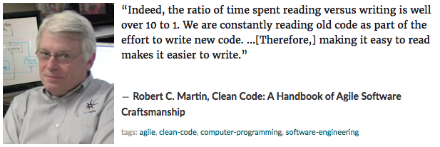

# Encuentros de la Tierra Media

En este juego, varios personajes cruzarán caminos en la Tierra Media para batirse a duelo.

## Personajes _[Characters]_

Existen diferentes tipos de personajes provenientes de distintas especies.

### [Magos _[Wizards]_](https://lotr.fandom.com/wiki/Gandalf)

Los magos tienen el dominio de la mágia, que provee capacidades de ataque y de defensa. La mágia es innata a ellos, aunque pueden adquirir más mediente el estudio de la asignatura, y mediante elementos que la potencian (por ejemplo, una [vara mágica](https://www.amazon.com/Harry-Potter-Elder-Wand-illuminating/dp/B007Z0O0BI/ref=pd_day0_hl_21_2/138-2245974-8929718?_encoding=UTF8&pd_rd_i=B007Z0O0BI&pd_rd_r=1f8fc491-9554-4f41-8579-fb61f109ea27&pd_rd_w=Tgy2Z&pd_rd_wg=HGVYt&pf_rd_p=ad07871c-e646-4161-82c7-5ed0d4c85b07&pf_rd_r=SJBGNBVTJE7XNZ5DXX5G&psc=1&refRID=SJBGNBVTJE7XNZ5DXX5G).)

### [Elfos _[Elves]_](https://lotr.fandom.com/wiki/Elves)

Los elfos son criaturas supernaturales que también poseen características mágicas, y en general son conocidos por ayudar a los demás.

### [Enanos _[Dwarves]_](https://lotr.fandom.com/wiki/Dwarves)

Los enanos son seres temperamentales, muy buenos en combate con las armas, físicamente fuertes, con mucha resistencia y leales a sus amigos.

## Elementos _[Items]_

Los personajes necesitan de ciertos elementos para poder combatirse y ayudarse. Estos elementos pueden ser ropaje (túnica, por ejemplo), armas (como un hacha o una espada), o poderes (magia o elementos mágicos).

Existe además un elemento en particular llamado el [Guante de Poder](https://www.amazon.co.uk/Supmaker-Infinity-Gauntlet-Avengers-Halloween/dp/B07Q249RF7), que por sí solo no tiene mucho poder. Para incrementar su poder necesita de un conjunto de gemas poderosas.

## Encuentros _[Encounters]_

A lo largo del camino, estos personajes medievales se cruzarán en encuentros amistosos de intercambio y en encuentros de combate.

### Encuentros de intercambio _[Exchange encounters]_

Los encuentros de intercambio es donde un personaje puede compartir uno o más items que posea con otro personaje. El primero perderá la pocesión del elemento, y el segundo será el nuevo dueño.

### Encuentros de combate _[Battle encounters]_

Los encuentros de combate son, bueno, eso, encuentros de combate. Dos personajes se batirán a duelo. El duelo termina solamente cuando uno de ellos muere.

## Escenarios _[Scenarios]_

Un escenario es la historia de uno o más personajes que se encuentran en uno o más encuentros. Un escenario es, escencialmente, una historia.

Existe un escenario interactivo que viene con el juego llamado Escenario de Consola (_Console Scenario_). Este escenario es 100% interactivo para que el jugador cree los personajes, les asigne elementos y genere encuentros. Este escenario termina automáticamente cuando quedan menos de dos personajes vivos.

----

----

# Desafío

## Parte 0: Repo

Cada equipo deberá crear un repo para el desarrollo de este juego. Todos los miembros del equipo deberán tener acceso al repo.

## Parte I: Creación

Lo primero que este juego necesita son algunos elementos adicionales. Los elementos (vestimenta, armas, poderes) le agregan riqueza al juego. 

En un repo compartido por los integrantes del equipo, cada integrante deberá solicitar utilizando un Issue de GitHub un elemento que desee agregar al juego. Por ejemplo, un integrante puede solicitar un _Escudo Medieval_, que tiene poder de defensa de 30 puntos.

Ver instrucciones para crear un issue [aquí](https://help.github.com/en/articles/creating-an-issue).

## Parte II: Agregar elementos

Cada integrante del equipo deberá agregar un elemento nuevo sugerido como Issue por otro compañero. 

Deberán desarrollarlo por separado e incluirlos al proyecto utilizando Pull Requests que refieran al issue del elemento correspondiente. Utilizando keywords pueden cerrar el issue. Ver [aquí](https://help.github.com/en/articles/closing-issues-using-keywords#closing-an-issue-in-the-same-repository) cómo hacerlo.
    
# Anexo: Diagrama de clases

* _Las clases en verde se encuentran definidas en el proyecto ConsoleGame._
